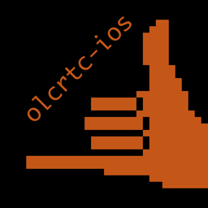
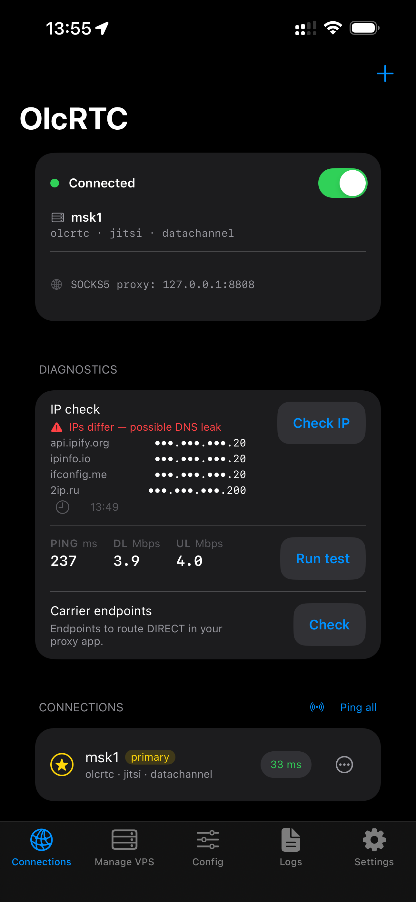
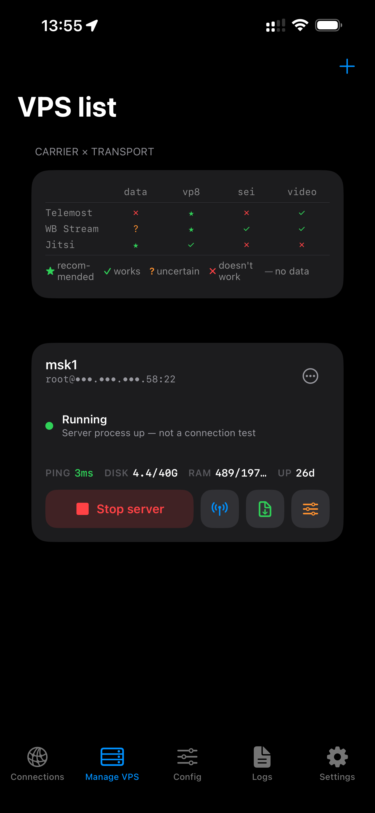
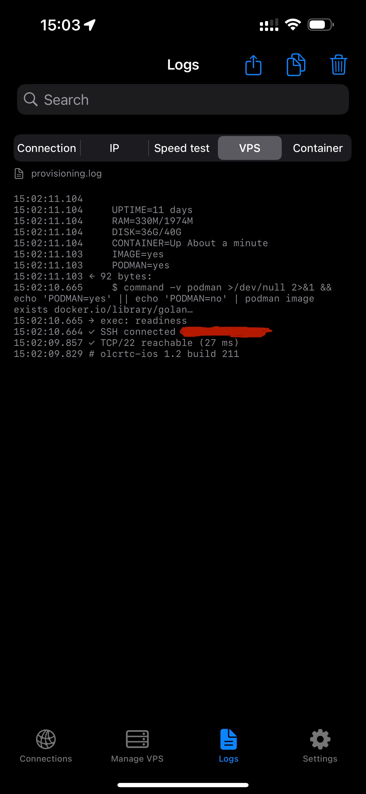
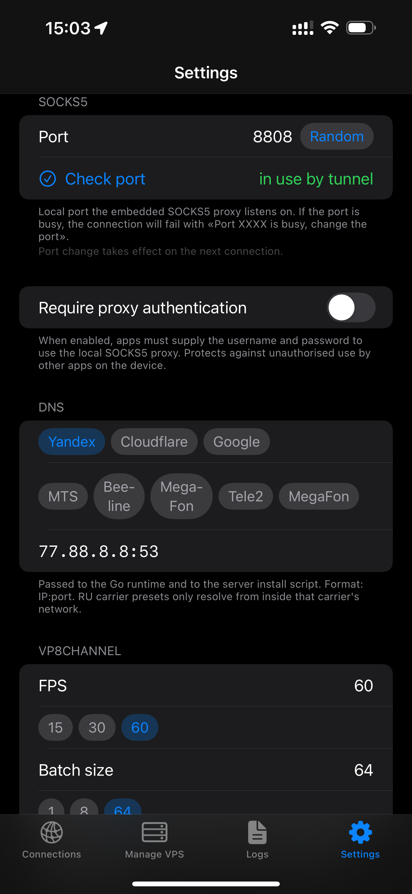
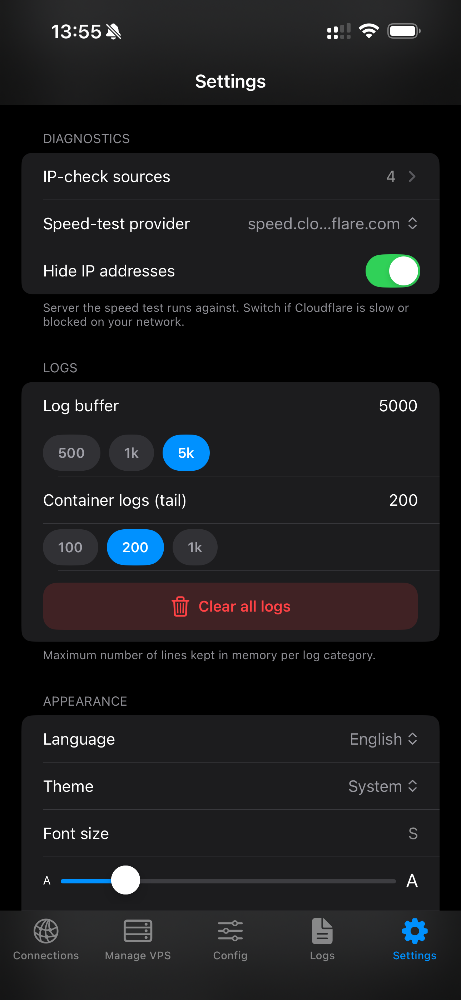

### olcrtc-ios

iOS client for [olcrtc](https://github.com/openlibrecommunity/olcrtc) — a WebRTC-based proxy that tunnels SOCKS5 traffic through video-conferencing carriers (Telemost, WBStream, Jitsi).

<br clear="left"/>

[](https://github.com/haritos90/olcrtc-ios/actions/workflows/ci.yml)


[](LICENSE)
[](docs/download-stats.md)

The app manages the full lifecycle end to end:

- **Provision** — SSH into a VPS, upload and run the install script, and capture the resulting `olcrtc://` URI.
- **Connect** — run the olcrtc Go core (via gomobile bindings) as a local SOCKS5 proxy.
- **Route** — point SOCKS5-aware apps, and the app's own diagnostics, at that local port. iOS has no system-wide per-app proxy routing without a NetworkExtension packet tunnel, so today's scope is the SOCKS5 port itself (a system-wide routing mode is a future option, not shipping yet).

---

## Legal Notice

This software is intended for development, testing, and research purposes only.

The author does not provide any guarantees regarding:

- availability of network access
- compatibility with specific services
- compliance with any external restrictions

Users are solely responsible for how they use this software and must comply with applicable laws.

## Usage Restrictions

This software is not intended to be used for bypassing access restrictions or violating applicable laws. The author does not support or encourage such use.

---

## Status

Alpha software — not intended for production use. The author sells nothing: not the app, access, configurations, subscriptions, or support; anything given is a voluntary donation.

---

## Features

- One-tap VPS provisioning over SSH (non-interactive install of the olcrtc server).
- Telemost / WBStream / Jitsi carriers, each with its own transport options.
- Local SOCKS5 proxy with optional username/password auth.
- Connection manager: multiple servers, QR import/export, primary selection.
- Built-in diagnostics: live logs, IP check, speed test, and per-connection ping / readiness probes.
- Background keep-alive so the tunnel survives app backgrounding.
- Full English / Russian localization.

---

## Screenshots


| Connections | VPS Management | Logs | Settings | More settings | 
|---|---|---|---|---|
|  |  |  |  |  |


---


## Install on your iPhone (sideload)

Every [GitHub Release](../../releases) ships a prebuilt **unsigned** `.ipa`
(`olcrtc-ios-unsigned.ipa`). It is unsigned on purpose — a sideloading app re-signs it with
*your own* Apple ID, and a free Apple ID is enough (the app needs no paid-only entitlements):
the signature then lasts **7 days** and free accounts keep at most three sideloaded apps;
a paid Apple Developer account extends the signature to a year. The two most user-friendly
sideloading apps, in order:

### SideStore — recommended

[SideStore](https://sidestore.io) is an AltStore fork that re-signs and refreshes apps
**on the iPhone itself, over Wi-Fi** — you need a computer once, to install SideStore, and
never again after that.

1. **Once: install SideStore** with [iLoader](https://github.com/nab138/iloader)
   (Windows / macOS / Linux): connect the iPhone over USB, sign in with your Apple ID, pick
   *Install SideStore* — iLoader also places the pairing file SideStore needs. Step-by-step:
   [SideStore install docs](https://docs.sidestore.io/docs/installation/install).
2. **Install [LocalDevVPN](https://apps.apple.com/us/app/localdevvpn/id6755608044)** (free,
   on the App Store) — the on-device loopback VPN SideStore uses to install and refresh apps
   without a computer.
3. **Install olcrtc-ios straight from the Release URL** — no manual `.ipa` download or
   transfer: on the [Release](../../releases) page, long-press the `olcrtc-ios-unsigned.ipa`
   asset and copy its link, then open it through SideStore's
   [install URL scheme](https://docs.sidestore.io/docs/advanced/url-schema) —
   `sidestore://install?url=<asset link>` in Safari. SideStore downloads and installs the app
   directly. (Fallback: download the `.ipa` and open it via SideStore ▸ *My Apps* ▸ **+**.)
4. **Renew the 7-day signature**: open LocalDevVPN ▸ *Connect*, then SideStore ▸ *My Apps* ▸
   *Refresh All* (or tap the *7 days* counter next to the app). With the VPN connected,
   SideStore also refreshes apps in the background before they expire.

### LiveContainer — alternative

[LiveContainer](https://github.com/LiveContainer/LiveContainer) runs sideloaded apps *inside*
its own container, so the apps it hosts don't count against the three-app limit and never need
per-app re-signing — only LiveContainer itself carries a 7-day signature, and its bundled
SideStore renews it.

1. **Once: install the *LiveContainer + SideStore* bundle** with the same
   [iLoader](https://github.com/nab138/iloader) USB step — pick *LiveContainer + SideStore*
   in iLoader. Step-by-step:
   [LiveContainer install docs](https://livecontainer.github.io/docs/installation/lc_sidestore).
2. **Install [LocalDevVPN](https://apps.apple.com/us/app/localdevvpn/id6755608044)** — same
   role as above; the built-in SideStore needs it to install and refresh.
3. **Install olcrtc-ios straight from the Release URL**: copy the `olcrtc-ios-unsigned.ipa`
   asset link from the [Release](../../releases) page and open
   `livecontainer://install?url=<asset link>` in Safari — LiveContainer fetches the `.ipa` and
   installs it into the container. (Fallback: download the `.ipa` and import it from Files.)
4. **Renew the 7-day signature**: LocalDevVPN ▸ *Connect*, then refresh LiveContainer through
   its built-in SideStore — the apps inside the container are untouched and never expire on
   their own.

<details>
<summary><b>Classic cable path</b> — AltStore or Sideloadly from a Mac / Windows PC</summary>

The original computer-based flow still works and may be more familiar:

1. Download `olcrtc-ios-unsigned.ipa` from the latest [release](../../releases).
2. On a Mac or Windows PC install a sideloading tool — [AltStore](https://altstore.io)
   (installs over Wi-Fi via AltServer) or [Sideloadly](https://sideloadly.io) (installs over a
   USB cable).
3. Connect the iPhone, open the tool, sign in with **your** Apple ID, and drop in the `.ipa`.
4. On the iPhone: **Settings ▸ General ▸ VPN & Device Management** → trust your developer
   certificate, then launch the app.

The same free-Apple-ID limits apply (7-day signature, three apps); re-run the tool on the
computer to refresh the signature.
</details>

Per-version install counts are tracked in [download statistics](docs/download-stats.md).

---

## Build it yourself

Everything needed to go from a clone to the app running on a device — or to your own
unsigned `.ipa`.

| Dependency | Needed for | Install |
|------------|------------|---------|
| **Xcode** — the full app, not just the Command Line Tools | Building the app, and the framework if you build it yourself (gomobile needs the iOS SDK) | Mac App Store |
| **XcodeGen** | Generating `olcrtc-ios.xcodeproj` from `project.yml` | `brew install xcodegen` |
| **GitHub CLI** (`gh`) | Downloading the prebuilt `Mobile.xcframework` | `brew install gh` |
| **Go** | Only if you build `Mobile.xcframework` from source | `brew install go` |

`Mobile.xcframework` — the gomobile-built olcrtc core (~228 MB) — is **not tracked in git**; you fetch or build it once, in the build steps below.

<details>
<summary><b>First-time toolchain setup</b> — Homebrew, and pointing at the full Xcode</summary>

Install [Homebrew](https://brew.sh) if you don't have it, then the tools above — `brew install xcodegen gh` (add `go` if you'll build the framework yourself).

The command line must point at the **full Xcode**, not the standalone Command Line Tools, or gomobile can't find the iOS SDK. Check with `xcode-select -p`; if it prints `CommandLineTools`, switch it and accept the licence:

```bash
sudo xcode-select -s /Applications/Xcode.app/Contents/Developer
sudo xcodebuild -license accept
```
</details>

### Build and run in Xcode

```bash
git clone https://github.com/haritos90/olcrtc-ios.git
cd olcrtc-ios
git submodule update --init --recursive     # fetches the olcrtc core into olcrtc-upstream/

./scripts/fetch-framework.sh                 # downloads the prebuilt Mobile.xcframework
xcodegen generate --spec project.yml         # writes olcrtc-ios.xcodeproj
open olcrtc-ios.xcodeproj
```

Set your signing team in Xcode (or `project.yml` → `DEVELOPMENT_TEAM`), then build and run.

<details>
<summary><b>Logging in to <code>gh</code></b> — once, for the framework download</summary>

`fetch-framework.sh` pulls `Mobile.xcframework` from a GitHub Release, so you sign in once:

```bash
gh auth login
```

`release not found` means no Release has been published for that tag yet — a freshly pushed tag's Release is built by CI and appears shortly after. Build the framework from source in the meantime ↓.
</details>

<details>
<summary><b>Building <code>Mobile.xcframework</code> from source</b> — instead of downloading it</summary>

Needs the full Xcode (gomobile uses the iOS SDK) and Go; the script installs gomobile if it's missing:

```bash
./scripts/build-framework.sh
```

Under the hood it runs this from the `olcrtc-upstream/` submodule:

```bash
gomobile bind -target=ios -o ../App/Mobile.xcframework ./mobile
```

`-target=ios` produces both the device and simulator slices. `gomobile: -target="ios" requires Xcode` means the toolchain is still on the Command Line Tools — see *First-time toolchain setup*.
</details>

### Build the unsigned .ipa

Needs the **full Xcode** (same iOS SDK requirement as the framework build) and an existing
`App/Mobile.xcframework`. One script builds the unsigned `.ipa` (compile for device without
signing, then wrap into `Payload/`):

```bash
./scripts/package-ipa.sh                 # → olcrtc-ios-unsigned.ipa
```

You normally don't need to — every `v*` tag's [release workflow](.github/workflows/release.yml)
builds and attaches `olcrtc-ios-unsigned.ipa` to the Release automatically, next to the framework.
To attach one by hand: `gh release upload <tag> olcrtc-ios-unsigned.ipa`.

### Updating

Pull the latest app and core, then regenerate the project:

```bash
git pull
git submodule update --init --recursive     # advances the olcrtc core if its pin moved
xcodegen generate --spec project.yml
```

`Mobile.xcframework` is gitignored, so `git pull` never changes it — your local copy carries over, and ordinary Swift edits don't need it rebuilt. Refresh it **only when the olcrtc core changed** (the `olcrtc-upstream` submodule pin moved) and you want that new core compiled in:

```bash
./scripts/fetch-framework.sh                 # download the rebuilt one, or
./scripts/build-framework.sh                 # build it yourself
```

---

## Project structure

```
olcrtc-ios/                      the iOS app (this repo)
├── App/                        Swift sources, grouped by responsibility:
│   ├── Core/                   TunnelManager, TunnelEngine, SSHRunner, ConnectionStore …
│   ├── Models/                 OlcrtcConnection, OlcrtcURI, ConnectionRecord …
│   ├── Services/               LogStore, SettingsStore, IPChecker, NetPing …
│   ├── Views/                  SwiftUI screens
│   ├── Security/               KeychainHelper, ConnectionSecretStore
│   ├── Utilities/              AppConstants, CarrierTransportMatrix
│   ├── Localization/           L10n + L10nTable (English source + translations)
│   ├── PrivacyInfo.xcprivacy   App Store privacy manifest (no tracking, no data collected)
│   └── Mobile.xcframework/     compiled olcrtc core (gomobile; not in git — download or build)
├── Tests/                      XCTest unit tests (URI parsing, env-var parity, …)
├── scripts/
│   ├── srv.sh                  VPS install script (patched copy of upstream)
│   ├── parity_check.py         build-phase check that keeps srv.sh in sync with upstream
│   ├── build-framework.sh      build Mobile.xcframework from the submodule (gomobile)
│   └── fetch-framework.sh      download a prebuilt Mobile.xcframework from a Release
├── .github/workflows/          CI (build + test + parity) and release (framework artifact)
├── docs/uri.md                 olcrtc:// URI format reference
├── olcrtc-upstream/            Git submodule — openlibrecommunity/olcrtc @ master (upstream source)
├── project.yml                 XcodeGen spec (source of truth; .xcodeproj is generated, gitignored)
├── AGENTS.md, CONTRIBUTING.md  AI-agent + contributor guides
└── .gitmodules
```

**The three "olcrtc" pieces** (easy to confuse):

- **`olcrtc-upstream/`** — the upstream submodule (Go core + `srv.sh`); used only
  at build time (parity check + building the framework).
- **`App/Mobile.xcframework`** — that core compiled for iOS via gomobile; this is
  what actually ships inside the app.
- **this repo** — the iOS app itself.

See **[CONTRIBUTING.md](CONTRIBUTING.md)** for conventions and **[AGENTS.md](AGENTS.md)**
for the AI-agent workflow.

---

## How srv.sh works

`scripts/srv.sh` is a **full verbatim copy** of `olcrtc-upstream/script/srv.sh` with non-interactive patches applied inline. Patches are marked with `# boc olcrtc-ios` / `# eoc olcrtc-ios` markers so they can be audited easily:

```bash
# boc olcrtc-ios: read carrier from env instead of interactive prompt
CARRIER=${OLCRTC_CARRIER:-telemost}
# eoc olcrtc-ios
```

`scripts/parity_check.py` runs as an Xcode pre-build phase and verifies that every **unmarked** line in `srv.sh` still appears verbatim in the upstream `olcrtc-upstream/script/srv.sh`. If upstream changes a command we depend on, the build fails until `srv.sh` is deliberately updated.

### Updating the olcrtc-upstream submodule

```bash
cd olcrtc-upstream
git pull origin master
cd ..
# Rebuild srv.sh if upstream changed script/srv.sh:
diff olcrtc-upstream/script/srv.sh scripts/srv.sh   # review differences
# Re-apply boc/eoc patches as needed, then:
python3 scripts/parity_check.py            # must pass before committing
```

---

## Architecture notes

### Connection flow

```
User taps Connect
  → TunnelManager.connect(record:)
      → start(record:)
          → engine.validate(details)     validate params (MainActor)
          → reservePortAndSettings()      reserve a free SOCKS port + snapshot settings (MainActor)
          → state = .connecting
          → Task.detached
              → runEngine()               drive the protocol engine off-MainActor
                  → engine.start()         OlcrtcEngine: MobileStartWithTransport + MobileWaitReady
                  → verifyTunnel()         end-to-end HTTPS probe through the SOCKS5 port
              → state = .connected
```

### VPS install flow

```
User taps Install
  → SSHRunner.install()
      → loadScript()        read srv.sh from the app bundle
      → uploadScript()      base64-encode + printf | base64 -d over SSH
      → launchBackground()  nohup srv.sh > /tmp/olcrtc-install.log &
      → pollUntilDone()     tail the log every 15 s until OLCRTC_URI= appears
  → parse the URI → save a ConnectionRecord
```

### Key design decisions

- **gomobile singleton** — the Go runtime is a package-level singleton; `TunnelManager` mirrors this so parallel connect attempts bail early.
- **TunnelEngine seam** — protocols sit behind a `TunnelEngine` protocol; `TunnelManager` is protocol-agnostic and dispatches to the engine named by `ConnectionDetails` (today `OlcrtcEngine`, the only place that touches `Mobile*`).
- **Background keep-alive** — `BackgroundRuntimeKeeper` plays a silent looping AVAudio buffer so iOS doesn't suspend the app while the tunnel is active (`UIBackgroundModes: audio`).
- **srv.sh parity** — instead of duplicating the install logic we keep a marked-up copy of the upstream script and fail the build on drift (see [How srv.sh works](#how-srvsh-works)).
- **ATS stays on** — `NSAllowsArbitraryLoads` is `false`, so all `URLSession` traffic is HTTPS (`SubscriptionFetcher` uses an ephemeral session with a DoH fallback). The only raw-socket path is `NetPing`'s `NWConnection` TCP latency probe, which ATS doesn't govern.

---

## Testing

```bash
# simulator names drift between Xcode versions — pick whatever iPhone is installed
UDID=$(xcrun simctl list devices available | grep -m1 'iPhone' | grep -oE '[0-9A-Fa-f-]{36}')
xcodebuild test \
  -project olcrtc-ios.xcodeproj \
  -scheme olcrtc-ios-tests \
  -destination "id=$UDID"
```

A broad suite of unit tests covers URI round-trips, carrier/transport rules, connection persistence, Keychain round-trips, the tunnel state machine and parameter validation, settings clamping, log secret-redaction, port availability / busy-error mapping, SSH output parsing, and `installEnv()` ↔ `srv.sh` env-var parity. They also run on every push and PR in [CI](.github/workflows/ci.yml).

---

## Troubleshooting

<details>
<summary><b>Build &amp; connection issues</b> — Xcode mismatch, parity failure, missing framework, SSH errors</summary>

<br>

### Xcode version mismatch

**Symptom:** project fails to open, or you see "deployment target X is not supported by this version of Xcode".

The project targets iOS 17 and requires Xcode 15 or later. Check your version with `xcodebuild -version`. If you have multiple Xcodes, run `sudo xcode-select -s /path/to/Xcode15.app` to switch. After switching, run `xcodegen generate --spec project.yml` to regenerate the `.xcodeproj`.

---

### Parity pre-build phase fails

**Symptom:** the build stops at the srv.sh parity pre-build phase with a diff error.

This means the upstream submodule (`olcrtc-upstream/script/srv.sh`) changed and your local `scripts/srv.sh` no longer matches it line-for-line outside the `# boc olcrtc-ios` / `# eoc olcrtc-ios` markers.

Fix:
```bash
cd olcrtc-upstream && git pull origin master && cd ..
diff olcrtc-upstream/script/srv.sh scripts/srv.sh   # review what changed
# Re-apply boc/eoc patches as needed, then verify:
python3 scripts/parity_check.py            # must pass before building
```

See [How srv.sh works](#how-srvsh-works) for the full patching workflow.

---

### Missing Mobile.xcframework

**Symptom:** Xcode cannot find `App/Mobile.xcframework`, or you see a "framework not found Mobile" linker error.

The framework is not in git — download or build it:

```bash
./scripts/fetch-framework.sh     # download a prebuilt (needs `gh auth login` + a published release), or
./scripts/build-framework.sh     # build from source (needs full Xcode + Go)
```

See [Build it yourself](#build-it-yourself) for the full prerequisites — including the full-Xcode
requirement and the `gomobile … requires Xcode` fix.

---

### Common SSH connect errors

| Error | Likely cause | Fix |
|---|---|---|
| **Timeout / connection hangs** | Port 22 is firewalled or the VPS is unreachable | Verify with `nc -zv <host> 22` from a terminal. Check VPS firewall rules. |
| **Authentication failed** | Wrong password or key, or the wrong username | Double-check credentials in the server profile. The app uses the username exactly as entered. |
| **Connection refused** | `sshd` is not running on the VPS | SSH into the VPS via another client and confirm `sshd` is running (`systemctl status sshd`). |

The app retries the connection twice (2 × 30 s) before surfacing the error. If it fails consistently, reproduce manually with `ssh user@host` to isolate whether the issue is network-side or credential-side.

</details>

---

## Contributing

Contributions are welcome. Before opening a PR:

- Read [CONTRIBUTING.md](CONTRIBUTING.md) for the conventions (Conventional Commits, English-only, task markers), and [AGENTS.md](AGENTS.md) if you work with an AI coding agent.
- Work is tracked in [TODO.md](TODO.md) — pick an **Open** task or file a new one.
- `xcodebuild test` and the `scripts/srv.sh` parity check run in [CI](.github/workflows/ci.yml) on every PR; keep them green.

Bug reports and feature requests use the [issue templates](.github/ISSUE_TEMPLATE).

---

## License

MIT — see [LICENSE](LICENSE).
